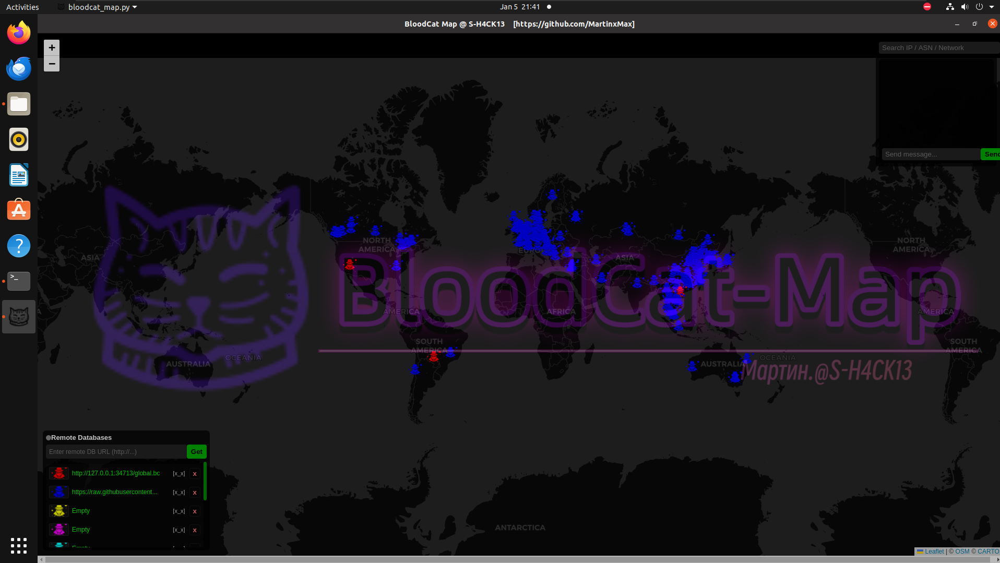
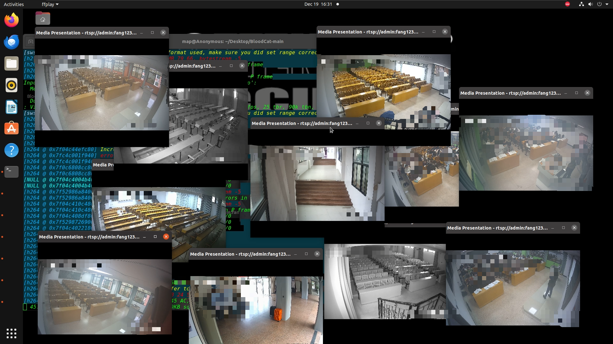
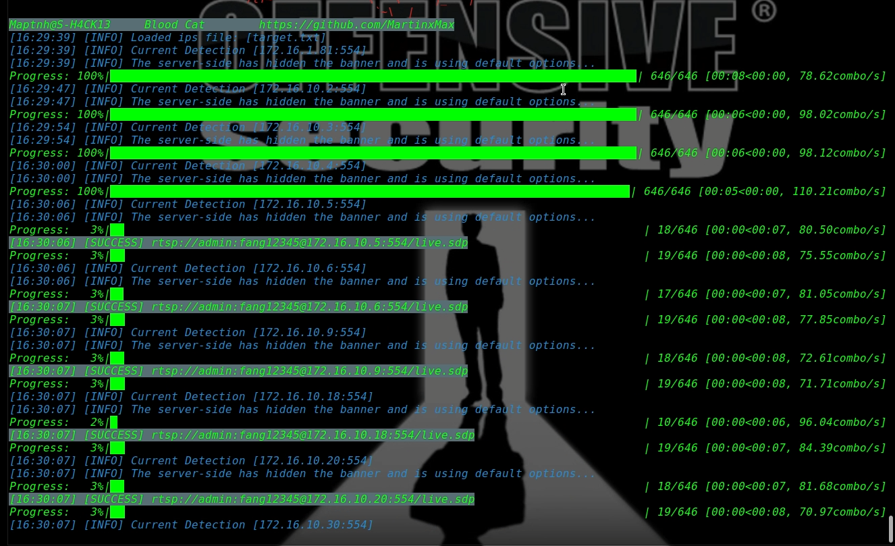

 

# Blood-Cat

A tool for hacking into publicly exposed network cameras, with support for specifying country and region.

```
Version 2.3
[+] BloodCat-Map: Multi-color icons to display data from different APIs respectively
[+] BloodCat-Map: Team-shared data API – you can share your data with other members via this feature
[+] BloodCat-Map: Pointer snapping – the mouse pointer will automatically snap when approaching a target
[+] BloodCat-Map: Team LAN chat – I adopted UDP broadcast encrypted communication, which undoubtedly reduces a lot of configuration work...
```




 





---

# Install Dependencies

```bash
$ sudo apt update && sudo apt install ffmpeg python3-pyqt5.qtwebengine
$ pip install geoip2 requests
``` 

If you are using the Windows operating system, please download `https://github.com/MartinxMax/BloodCat/releases/download/play/ffplay.exe` and move the downloaded .exe file into the `./lib/` directory.

---

# Usage

```bash
$ python3 bloodcat.py -h
```


---

## Bruteforce for  IP list

```bash
$ python3 bloodcat.py --ips target.txt
```



## Bruteforce a specific camera IP

```bash
$ python3 bloodcat.py --ip "80.191.192.230:554"
```


---

## Bruteforce camera IPs in a specific country/region (via FoFa)

```bash
$ python3 bloodcat.py --country CN --region HK --key <FOFA-API-KEY>
```


---

# File Path

All discovered results will be saved to:

```
./data/ipcam.info
```


---

# Blood-Cat-Map & Launch Viewer

```bash
$ python3 bloodcat_map.py
```
 


 

