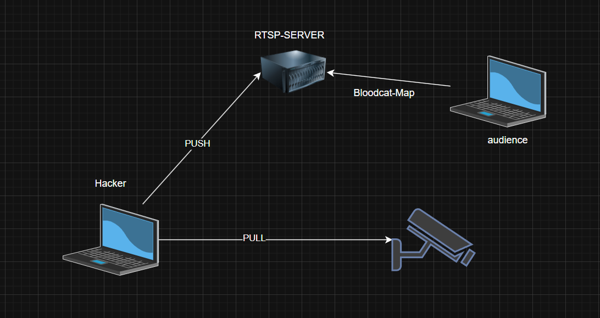
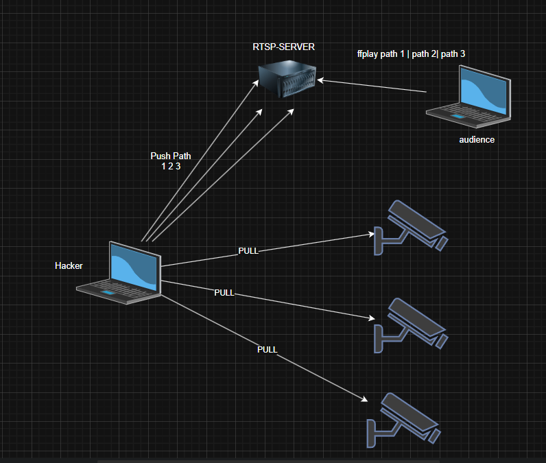
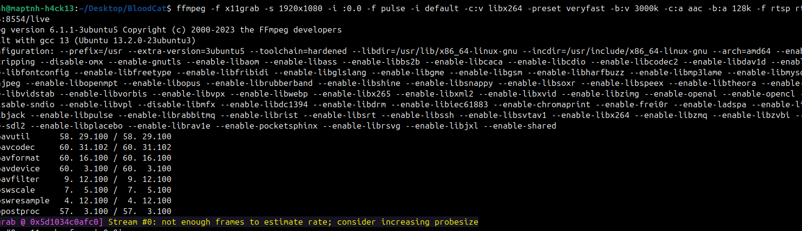
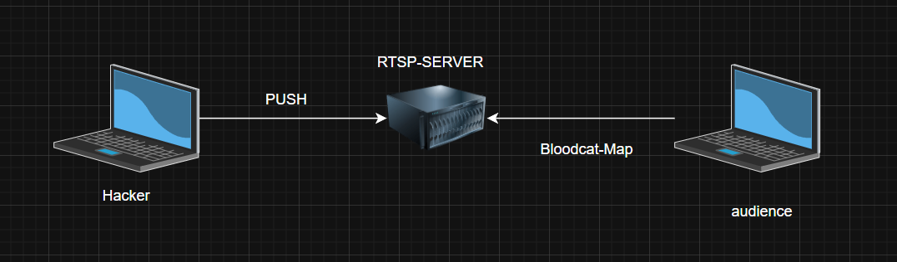
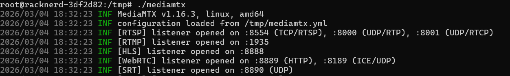
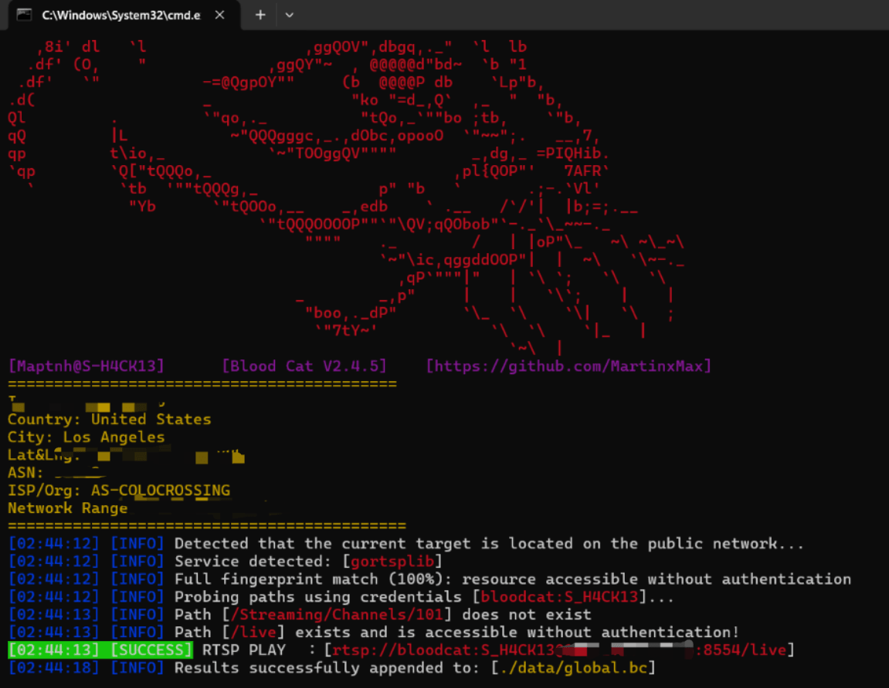
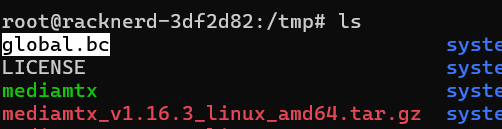
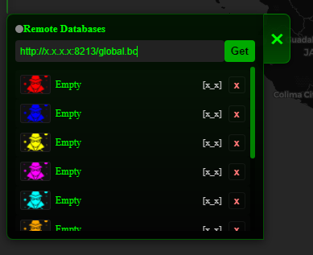
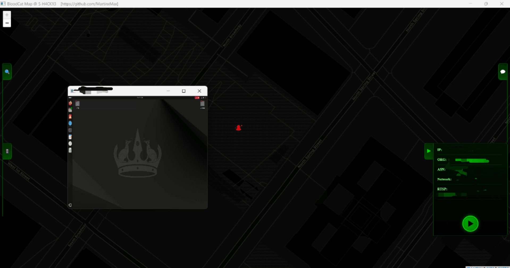

# Push Your Live Stream or Private Network Camera Feed to Bloodcat Map for Subscribers to Play

There are many techniques to map private network cameras to public access.

If you want to map a single private network camera for public access, you can import it into BloodCat-Map for playback (because in Bloodcat-Map, one public IP can only map one camera).



However, if you want to map multiple private cameras, you should use `ffplay` or other playback methods.




Below is an example of streaming your desktop to be accessible on Bloodcat-Map.

---



### Start the RTSP server

https://github.com/bluenviron/mediamtx/releases

```bash
(Server)$ tar -zxvf xxxx.tar.gz
(Server)$ chmod +x mediamtx
(Server)$ cp payload.yml mediamtx.yml
(Server)$ ./mediamtx
```



### Start the streaming machine

```bash
(Live)$ sudo apt install ffmpeg -y
(Live)$ ffmpeg -f x11grab -s 1920x1080 -i :0.0 -f pulse -i default -c:v libx264 -preset veryfast -b:v 3000k -c:a aac -b:a 128k -f rtsp rtsp://<Server>:8554/live
```

### Save to a local `.bc` file

```bash
(Live)$ python bloodcat.py --ip "<Server>:8554"
```



### Upload the `.bc` file to any directory on the server



```bash
(Server)$ python3 -m http.server 8213
```

### Audience operations

```bash
(audience)$ python bloodcat_map.py
```

Enter the remote address:



Click play to see the Ubuntu desktop stream:


